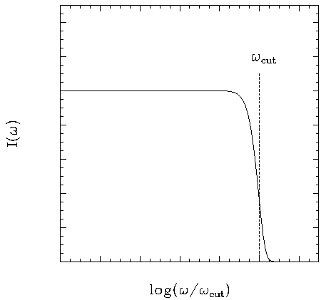

Astrophysics
===============

Wave Bands
-------------------------

A table of wavebands in astronomy is something like this.

Doppler Shift
--------------------------

The special relativistic doppler shift can be derived using the fact that 4-momentum is a vector thus it transforms under Lorentz transformation.

.. image:: assets/astrophysics/dopplerRedshift.png
   :align: center

The observer is fixed in O' frame and source is in O frame. Emitting angle in O frame is :math:`\theta`.

Since momentum is a vector, we have the Lorentz transformation which transfrom it in to O' frame,

.. math::
   \frac{E'}{c} = \gamma \left(\frac{E}{c} - \beta p_x\right),

where we also have

.. math::
   p_x &= p\cos\theta,
   p = E/c.

Combining these equations, the energy of the photons in O' frame is

.. math::
   E' = E \gamma (1 - \beta \cos\theta).

In quantum mechanics, energy is related to angular frequency,

.. math::
   E = \hbar \omega.

The angular frequency in O' frame is

.. math::
   \omega ' = \omega \gamma (1-\beta \cos\theta).

Redshift is define as

.. math::
   z &= \frac{\nu_e - \nu_o}{\nu_o} \\
   & = \frac{\omega_e - \omega_o}{\omega_o} \\
   & = \frac{1/\gamma - 1 + \beta\cos\theta}{1-\beta \cos\theta}.

.. admonition:: Non-relativistic Doppler Shift

   To understand the effect of relativity, we would first recall the non-relativistic doppler shift.

   .. math::
      \omega'_{non-rel} = \omega_{non-rel}(1-v/c \cos\theta).

   where no :math:`\gamma` is relavent. It's obvious that we have only two kinds of shift, redshift due to the source is closing, or blueshift due to the fact that the source is moving away.

Here we have three different kinds, the additional one is the transverse redshift due to the :math:`\gamma` factor or the contraction of time.

An gif from wikipedia shows this explicitly,

.. figure:: assets/astrophysics/XYCoordinates.gif
   :align: center

   Image Source: `File:XYCoordinates.gif <https://en.wikipedia.org/wiki/File:XYCoordinates.gif>`_

Photon Production
----------------------

There are two important processes that produces photons in astrophysical environment, namely thermal Bremsstrahlung and synchrotron radiation.

Bremsstrahlung Radiation
~~~~~~~~~~~~~~~~~~~~~~~~~~

   This is the spectrum of frequency-dependent emissivity of the process which happens when a flux of non-relativistic regime with thermal distributon of temperature T is shot into a plasma of ions or protons.

Compton Scattering
----------------------

The quantities we are interested in are cross section and radiated power, both of which are Lorentz invariant.

Thomson Scattering
~~~~~~~~~~~~~~~~~~~

Total cross section of Thomson scattering can be obtained using only classical electrodynamics. The physics behind it is that the electric field excerts force on an electron then the electron emits photons to all possible direction as it oscillates.

The incoming power per unit area is

.. math::
   P_{inc}= c u_{rad},

as :math:`u_{rad} = \frac{E^2}{4\pi}` is the energy density of EM field.

The outgoing or scattered wave power (total) is

.. math::
   P_{scatt} = \frac{2}{3}\frac{e^4}{m_e^2 c^3} E^2.

The total cross section is ratio of the two quantity, i.e.,

.. math::
   \sigma_T \equiv \frac{P_{scatt}}{P_{inc}} =\frac{8\pi e^4}{3 m_e ^2 c^4} = \frac{8\pi (\alpha \hbar c)^2}{3 m_e ^2 c^4},

in which the fine structure constant is defined as :math:`\alpha = \frac{e^2}{\hbar c}`.

Compton Scattering
~~~~~~~~~~~~~~~~~~~~~

The full quantum electrodynamics result is called Klein-Nishima formula, which describes the total cross section of coliding photon and electron,

.. math::
   \sigma_{K-N} = \frac{\pi e^4}{m_e^2 c^4} \frac{1}{\epsilon} \left[ \left(1 - \frac{2(\epsilon+1)}{\epsilon^2}\right) \ln (2\epsilon + 1) + \frac{1}{2} + \frac{4}{\epsilon} - \frac{1}{2(2\epsilon + 1)^2} \right],

where :math:`\epsilon = \frac{E}{m_e c^2}`.

In the limit that energy of electron is much larger than photons, we have :math:`\epsilon` is much smaller than 1, we would come back to the Thomson limit, which is true for our equation,

.. math::
   \sigma_{K-N} &= \sigma_T \frac{3 \left(\left(1-\frac{2 (x+1)}{x^2}\right) \log (2 x+1)+\frac{4}{x}-\frac{1}{2 (2 x+1)^2}+\frac{1}{2}\right)}{8 x} \\
   & = \sigma_T (1 - 2\epsilon + O(x^2)).

To have more understanding on this formula, I ploted :math:`\sigma_{K-N}` in terms of :math:`\sigma_T` as the energy scale :math:`\epsilon` changes.

.. image:: assets/astrophysics/comptonScattering.png
   :align: center

Asteroseismology
---------------------

The stars do shake, from inside out.

Long period variable such as Cepheids pulsate in the luminosity. This is because of the radial oscillation mode with a approximate period of

.. math::
   P_{dynamical} \approx \left( \frac{R^3}{GM} \right)^{1/2} \approx (G\bar \rho)^{-1/2},

in which we have the radius of the star as :math:`R`, mass of the star as :math:`M` and mean density :math:`\bar \rho`. **The good thing of this oscillation immediately shows us the mean density of the star, even without any furthure inspectation.**

There are double mode Cepheids, whose modes provides information about mass and radius.

Our sun, up to now we have identified thousands of individual modes. And more modes as many as :math:`10^{6}` modes can be determined accurately.[^helioosc]_

.. [^helioosc] `Jørgen Christensen-Dalsgaard's Lecture Notes <http://users-phys.au.dk/jcd/oscilnotes/chap-1.pdf>`_

Papers, Researches and More
~~~~~~~~~~~~~~~~~~~~~~~~~~~~~~~~~~~~~~~~~~~~~~~~~~~

1. Double mode Cepheids, J. Otzen Petersen, 1973, 1974, 1978.
2. An introduction of seismology applied to stars. http://ap.smu.ca/~guenther/seismology/seismology.html

Refs & Notes
-------------------
